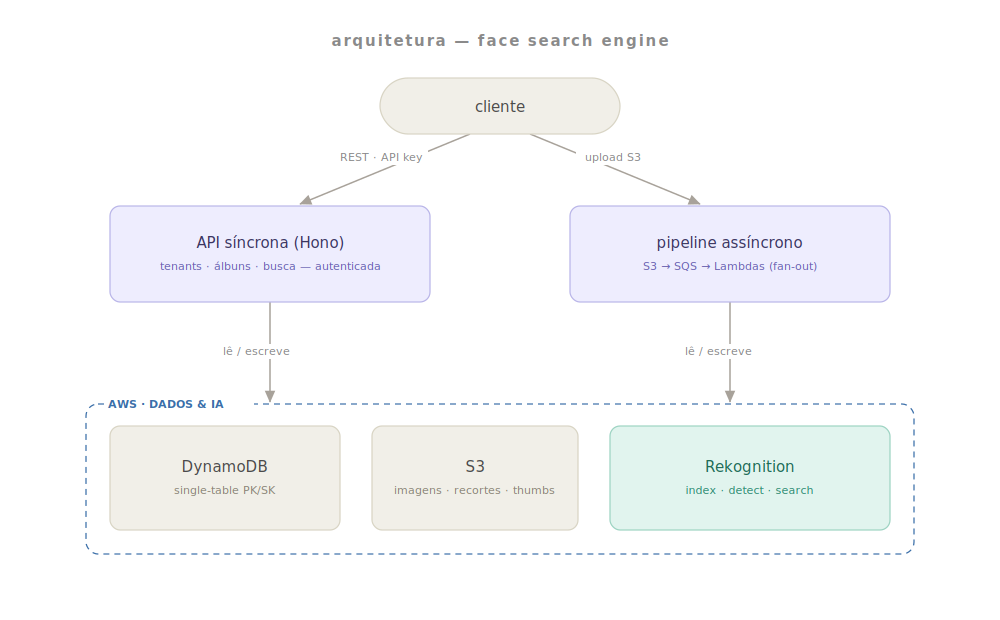
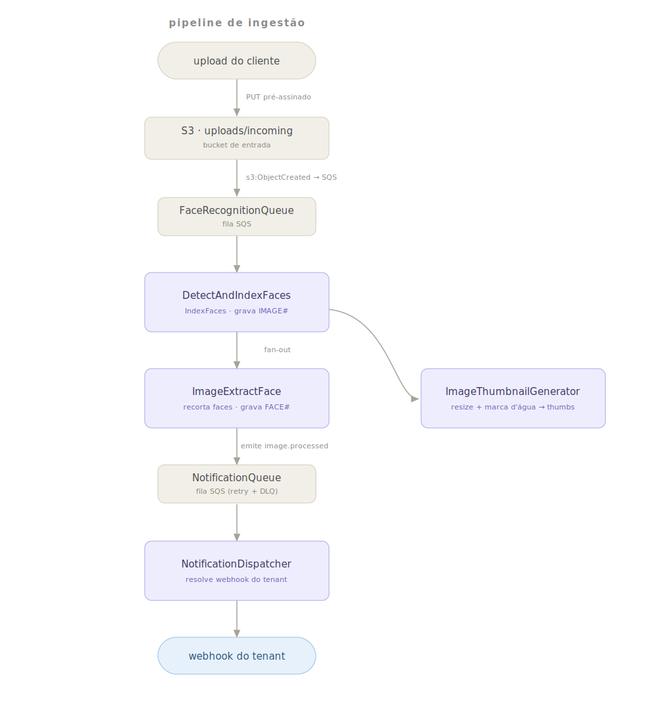
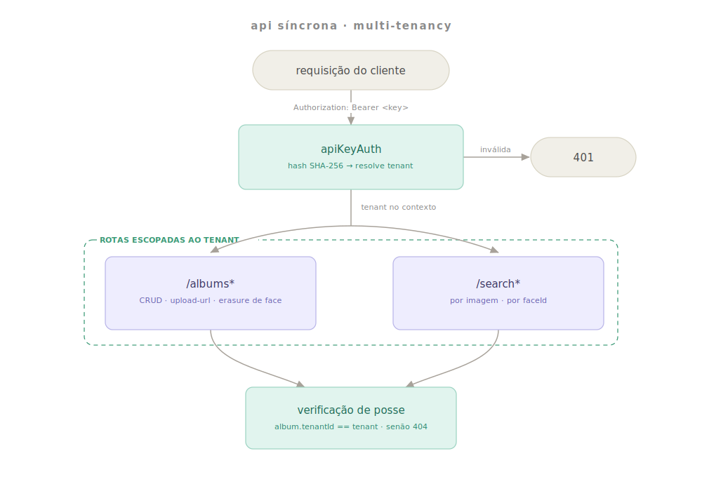
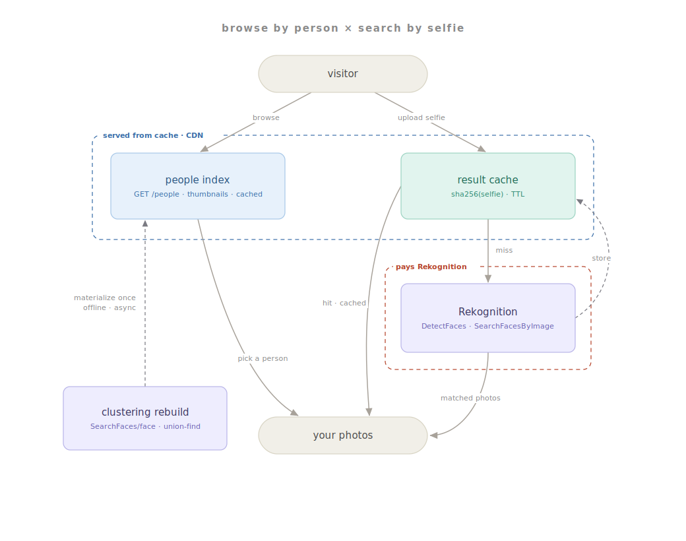

# sls-find.me — Face Search Engine

> Motor de **busca facial** serverless sobre **AWS Rekognition**. Multi-tenant, autenticado por API key, com um pipeline de processamento **event-driven** e **notificação de conclusão** via webhook.

O cliente sobe fotos para dentro de "coleções" (álbuns) do Rekognition; o sistema indexa os rostos, recorta cada face, gera thumbnails com marca d'água e expõe endpoints REST para buscar rostos semelhantes — por imagem ou por `faceId`.

Comentários de código e mensagens da API são escritos em **português (pt-BR)**.

---

## Proposta

Dado um conjunto de fotos, responder rápido à pergunta: **"em quais fotos esta pessoa aparece?"**

- **Ingestão** — o cliente faz upload das imagens; cada rosto é detectado, indexado e recortado de forma assíncrona.
- **Busca** — envia-se uma foto (ou um `faceId` já conhecido) e recebe-se a lista de imagens com rostos semelhantes acima de um limiar de similaridade.
- **Multi-tenancy** — cada cliente (tenant) é isolado por API key; um álbum só é visível/operável pelo tenant que o criou.
- **LGPD** — como o dado é biométrico (sensível), há **direito ao esquecimento**: deleção de uma face remove-a do Rekognition, do S3 e do DynamoDB.
- **Notificação** — quando o processamento de um upload termina, o tenant é avisado por webhook (`image.processed`).

---

## Arquitetura

O sistema tem **duas metades** que compartilham os mesmos dados: uma **API síncrona** (autenticada) e um **pipeline assíncrono** (event-driven). Ambas conversam com DynamoDB, S3 e Rekognition.

<p align="center">
  
</p>

- **API síncrona** — um único app **Hono** (`OpenAPIHono`) empacotado como um Lambda, servindo `/tenants`, `/albums*` e `/search*`. Toda a superfície é autenticada.
- **Pipeline assíncrono** — uma cadeia de Lambdas desacoplada por **SQS**, disparada por eventos do S3. Faz o trabalho pesado (indexação, recorte, thumbnail) fora do caminho da requisição.
- **Dados & IA** — DynamoDB (single-table), S3 (imagens/recortes/thumbnails) e Rekognition (index/detect/search).

### Pipeline de ingestão (assíncrono)

Um upload dispara um fan-out de Lambdas. Nada disso está no caminho síncrono da requisição do cliente.

<p align="center">
  
</p>

1. **Upload** — o cliente pega uma URL S3 pré-assinada (rota `/albums/{id}/upload-url`) e envia a imagem para `uploads/incoming/{collectionId}/{imageId}.jpg`.
2. **S3 → SQS** — o evento `s3:ObjectCreated` empurra para a `FaceRecognitionQueue`.
3. **`DetectAndIndexFaces`** — consome a fila, chama `IndexFaces` no Rekognition, grava o item `IMAGE#` e faz **fan-out** para duas filas.
4. **`ImageExtractFace`** — recorta cada rosto com `sharp`, salva em `uploads/faces/...`, grava os registros `FACE#` e emite `image.processed` na `NotificationQueue`.
5. **`ImageThumbnailGenerator`** — redimensiona e aplica a marca d'água, salvando em `uploads/thumbnails/...`.
6. **`NotificationDispatcher`** — consome a `NotificationQueue`, resolve o `webhookUrl` do tenant e faz `POST` do evento (com retry + DLQ do SQS).

> Confiabilidade: as filas de processamento têm `maxReceiveCount: 3` (retry antes da DLQ) e os handlers usam `ReportBatchItemFailures` — um erro nunca é engolido silenciosamente, ele reprocessa.

### API síncrona & multi-tenancy

Toda rota de `/albums*` e `/search*` passa pelo middleware `apiKeyAuth`, que resolve o tenant a partir da API key e injeta-o no contexto. Cada operação é então escopada ao tenant dono do álbum.

<p align="center">
  
</p>

- **Autenticação** — `Authorization: Bearer <key>` (ou header `x-api-key`). A key é buscada por `APIKEY#{sha256(key)}`; só o **hash** é persistido.
- **Escopo por tenant** — antes de qualquer operação, verifica-se `album.tenantId == tenant` — senão **404** (sem vazar existência entre tenants).
- **Provisionamento** — `POST /tenants` cria um tenant e emite a primeira API key. É protegido pelo segredo `ADMIN_API_KEY` (middleware `adminAuth`, comparação timing-safe), **não** pela API key de tenant.

### Busca & navegação — dois caminhos por custo

O uso mais comum é **navegar pelas pessoas** do álbum, não subir uma selfie a cada clique. Por isso há dois caminhos, separados por custo: a navegação por pessoa é **materializada e cacheável** (servível por CDN, sem Rekognition na leitura), e a busca por selfie é o **fallback** que paga Rekognition — com cache de resultado (`sha256(selfie)` + TTL) para não pagar duas vezes pela mesma busca.

<p align="center">
  
</p>

- **Navegar por pessoa** (barato, cacheável) — `PersonClusteringService.rebuild` agrupa as faces do álbum em "pessoas" via union-find sobre `SearchFaces` e grava registros `PERSON#`. As leituras `GET /albums/{id}/people` e `GET /albums/{id}/people/{personId}/photos` só leem o que foi materializado (zero Rekognition) e enviam `Cache-Control`.
- **Buscar por selfie** (fallback, paga Rekognition) — `POST /search` checa o cache de resultado; no *miss*, chama `DetectFaces` + `SearchFacesByImage` e grava o resultado no cache.

---

## Modelo de dados (DynamoDB single-table)

Tabela `...-rekognition-bucket-assets-controll`, chaves `PK`/`SK`, com um GSI `SK-Index`.

| Entidade | PK | SK | Observações |
|---|---|---|---|
| Álbum | `ALBUM#{id}` | `METADATA` | carrega `TenantId` |
| Imagem | `ALBUM#{id}` | `IMAGE#{externalImageId}` | thumbnail + original + faces |
| Face | `ALBUM#{id}` | `FACE#{faceId}` | `Confidence`, `ExternalImageId` |
| Tenant | `TENANT#{id}` | `METADATA` | `WebhookUrl` opcional |
| API key | `APIKEY#{sha256(key)}` | `METADATA` | mapeia para `TenantId` (só o hash) |
| Pessoa | `ALBUM#{id}` | `PERSON#{personId}` | cluster de faces (browse-by-person); `FaceIds`, `Images`, `CoverKey` |
| Cache de busca | `SEARCHCACHE#{id}` | `HASH#{sha256(image)}` | resultado de `/search`; expira por TTL (`ExpiresAt`) |

**Identidade unificada:** `externalClientAlbumId` == `CollectionId` do Rekognition == a partição do álbum — todos o mesmo UUID.

**Layout no S3:** `uploads/incoming/`, `uploads/faces/`, `uploads/thumbnails/`, cada um namespaced por `{collectionId}`.

---

## Endpoints

| Método | Rota | Descrição |
|---|---|---|
| `POST` | `/tenants` | Provisiona um tenant + API key (admin, `x-admin-key`) |
| `POST` | `/albums` | Cria um álbum (+ coleção Rekognition + pasta S3) |
| `GET` | `/albums/{id}` | Metadados do álbum |
| `DELETE` | `/albums/{id}` | Remove álbum, coleção e objetos |
| `GET` | `/albums/{id}/faces` | Lista as faces indexadas |
| `DELETE` | `/albums/{id}/faces/{faceId}` | **Erasure de face (LGPD)** — Rekognition + S3 + Dynamo |
| `POST` | `/albums/{id}/upload-url` | URL S3 pré-assinada para upload |
| `GET` | `/albums/{id}/people` | **Navegar por pessoa** — lista os clusters (cacheável) |
| `GET` | `/albums/{id}/people/{personId}/photos` | Fotos de uma pessoa (cacheável) |
| `POST` | `/albums/{id}/people/rebuild` | Reconstrói os clusters (offline, paga Rekognition) |
| `POST` | `/search` | Busca por imagem — selfie (header `x-collection-id`, body `{ image }` base64; com cache de resultado) |
| `POST` | `/search/by-face-id` | Busca por `faceId` (header `x-collection-id`, body `{ faceId }`) |

Docs interativas: **Swagger UI** em `/api/docs` e **Scalar** em `/api/docs/scalar`.

---

## Stack

- **Linguagem:** TypeScript · **Runtime:** Node (local `v22.22.2` no `.nvmrc`; Lambdas em `nodejs20.x`)
- **API:** [Hono](https://hono.dev) (`@hono/zod-openapi`) — rotas declaradas com schemas Zod
- **IaC:** Serverless Framework v4 → CloudFormation (Lambda, API Gateway, S3, SQS, DynamoDB, Rekognition)
- **Imagem:** `sharp` (via Lambda layer nativo)
- **Testes:** Vitest · **Lint/format:** Biome (tabs, aspas duplas)

---

## Comandos

```bash
npm run build          # limpa build/, compila (tsc) e copia assets
npm run dev            # nodemon + serverless offline em 0.0.0.0:4000
npm test               # vitest (watch)
npm run coverage       # cobertura
npm run lint           # biome check --write

npm run deploy:dev     # sls deploy --stage dev
npm run deploy:hml     # sls deploy --stage hml
npm run deploy:prd     # sls deploy --stage prd
```

Rodar um único teste:

```bash
npx vitest run app/handlers/image-extract-face.test.ts
npx vitest run -t "parses collectionId"
```

> **Build antes do deploy/run:** os handlers do `serverless.yml` apontam para `build/handlers/...`, então um `npm run build` é necessário antes de rodar localmente ou deployar.

---

## Configuração de ambiente

| Variável | Uso |
|---|---|
| `ADMIN_API_KEY` | Segredo que protege o provisionamento (`POST /tenants`) |
| `DISCORD_WEBHOOK_URL` | Destino das mensagens de DLQ (`FailureNotification`) |
| `AWS_REGION_DEFAULT` | Região (default `us-east-1`) |

As URLs de fila, nome de tabela e bucket são injetadas pelo `serverless.yml` como variáveis de ambiente por função.
