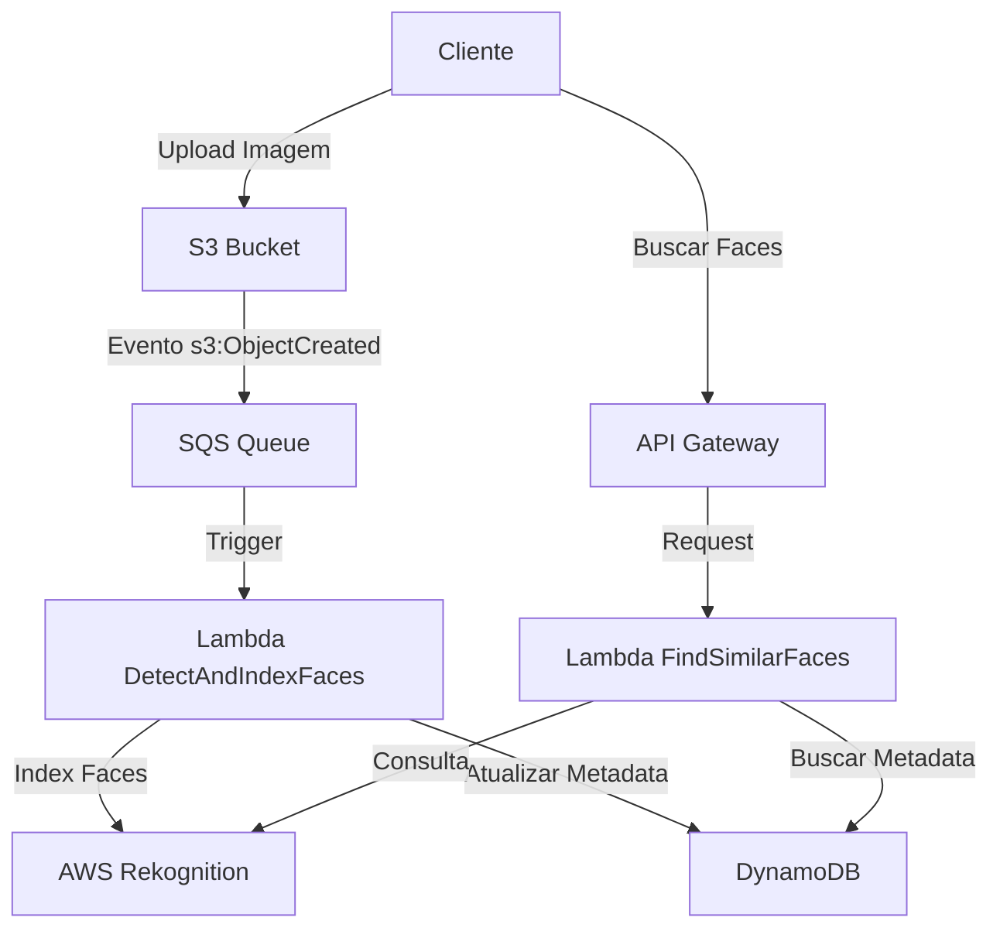
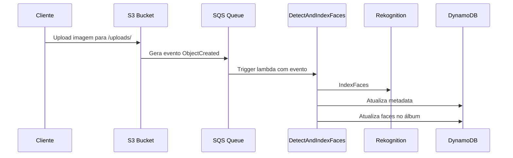
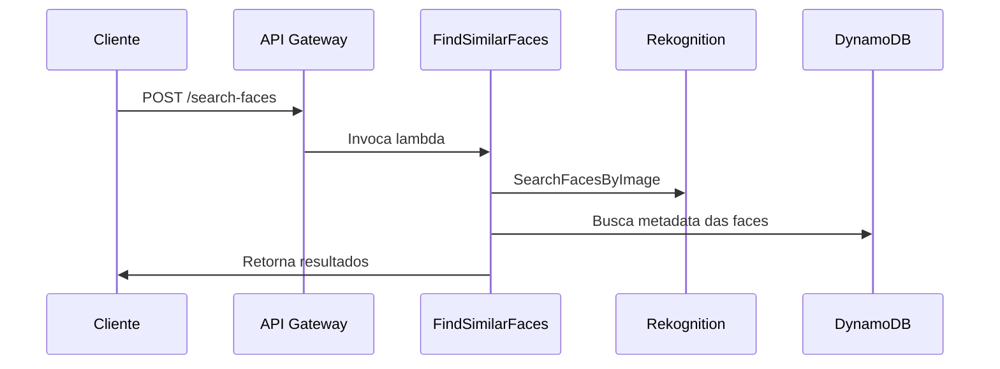

Ideias 💡

Ter um função para gerar os rostos únicos de referências para as pesquisas fotos dentro dos albums.

- Utilizar das fotos das pessoas em que elas aparecem sozinhas (Ajuda a conseguir um bom recorte dp rosto e área da cabeça)

---

Amazon Rekognition

- SearchFacesByImage
- SearchFaces
- ListFaces
- IndexFaces
- DetectFaces

Como uma API Rest.

# Face Search Engine usando AWS Rekognition e Arquitetura Serverless

## Visão Geral

Este documento descreve a arquitetura, fluxos de operações, e definições de métodos de uma API para um Face Search Engine. O sistema identifica, indexa, e busca rostos utilizando AWS Rekognition. A implementação utiliza AWS Lambda para a lógica de backend e AWS API Gateway para expor a API REST.

## Arquitetura do Sistema

### Componentes Principais

- **AWS API Gateway:** Interface de entrada para as requisições REST.
- **AWS Lambda:** Funções serverless que contêm a lógica de negócio.
- **AWS Rekognition:** Serviço de análise de imagens para detecção e comparação de rostos.
- **Amazon S3:** Armazenamento das imagens.
- **Amazon DynamoDB:** Armazenamento de metadados e referências das faces indexadas.

### Fluxo de Operações

1. **Indexação de Faces:**

   - Usuário envia uma imagem para a API.
   - A API Gateway invoca uma função Lambda para processar a imagem.
   - A função Lambda utiliza `IndexFaces` do AWS Rekognition para detectar e indexar as faces na imagem.
   - Os metadados das faces indexadas são armazenados no DynamoDB.

2. **Busca por Imagem:**

   - Usuário envia uma imagem para busca.
   - A API Gateway invoca uma função Lambda para processar a imagem.
   - A função Lambda utiliza `SearchFacesByImage` para buscar faces semelhantes na coleção de faces indexadas.
   - Retorna os resultados para o usuário.

3. **Busca por FaceId:**

   - Usuário fornece um faceId para busca.
   - A API Gateway invoca uma função Lambda para processar a busca.
   - A função Lambda utiliza `SearchFaces` para buscar faces semelhantes baseadas no faceId fornecido.
   - Retorna os resultados para o usuário.

4. **Listagem de Faces:**

   - Usuário solicita a listagem de todas as faces indexadas.
   - A API Gateway invoca uma função Lambda que utiliza `ListFaces` para listar todas as faces na coleção.
   - Retorna os metadados das faces para o usuário.

5. **Detecção de Faces:**
   - Usuário envia uma imagem para detectar rostos.
   - A API Gateway invoca uma função Lambda para processar a imagem.
   - A função Lambda utiliza `DetectFaces` para detectar rostos na imagem.
   - Retorna os detalhes das faces detectadas para o usuário.

### Desenho da Arquitetura

## Arquitetura do Sistema

## Fluxo de Processamento

### 1. Upload de Imagem

### 2. Busca por Faces Similares

